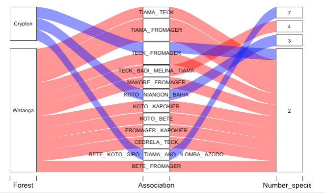

ggaluvial\_graph\_SatRdays
================
Evans, E.
23/07/2022

Charger les données

``` r
data_ass<- readRDS(file = "../data/forest_ass.rds")
View(data_ass)
```

Visualiser le graphique

``` r
library(dplyr)
```

    ## Warning: package 'dplyr' was built under R version 4.1.2

    ## 
    ## Attaching package: 'dplyr'

    ## The following objects are masked from 'package:stats':
    ## 
    ##     filter, lag

    ## The following objects are masked from 'package:base':
    ## 
    ##     intersect, setdiff, setequal, union

``` r
library(ggplot2)
```

    ## Warning: package 'ggplot2' was built under R version 4.1.2

``` r
library(forcats)
library(alluvial)
library(ggalluvial)

top_numb_spec <- data_ass %>% 
  count(no_species) %>% 
  pull(no_species)

top_association <- data_ass %>% 
  filter(no_species %in% top_numb_spec) %>% 
  count(association) %>% 
  pull(association)

forest <- data_ass %>% 
  filter(no_species %in% top_numb_spec & association %in% top_association) %>% 
  count(name_forest, association, no_species) %>% 
  mutate(name_forest = fct_relevel(as.factor(name_forest), c("Watanga", "Rubicon")))
```

    ## Warning: Unknown levels in `f`: Rubicon

``` r
alluvial(forest %>% select(-n),
         freq=forest$n, border=NA, alpha = 0.5,
         col=case_when(forest$name_forest == "Watanga" ~ "red",
                       forest$name_forest == "Rubicon" ~ "blue",
                       TRUE ~ "orange"),
         cex=0.75,
         axis_labels = c("Forest", "Association", "Number_species"))  
```


